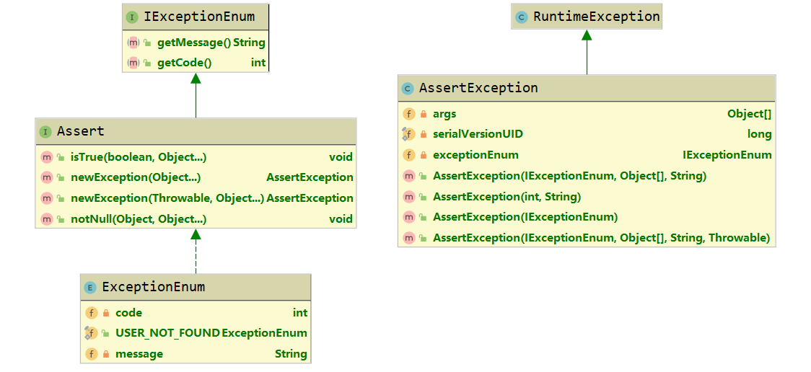

# 统一异常处理

Spring


### 背景
之前代码中存在大量的try{}catch{}，严重影响代码的可读性，将异常统一处理
```
Response add(String params){
    AppResponse resp = new AppResponse();
    try {
        XXXXX
    }catch (Exception1 e){
        XXXXX
    }catch (Exception2 e){
        XXXXX
    }
    return resp;
}
```
### 统一异常处理
Spring在3.2版本增加了一个注解@ControllerAdvice，可以与@ExceptionHandler配合使用;
@ControllerAdvice注解类为全局异常处理类；
@ExceptionHandler注解方法为对异常处理的方法
```
@ControllerAdvice
public class GlobalExceptionHandler {
    @ExceptionHandler(XXException.class)
    @ResponseBody
    public String handleException(){
        return "Exception Deal!";
    }
}
```
两者结合使用可以对全局的controller层的异常进行处理，不必在controller进行try{}catch{}；
但是存在的缺点是：业务系统中抛错时我们需要知道具体的错误码及错误信息，而不是NullPointerException；
我们当然可以在service中 try{}然后throw 自定义的Exception，不过那样确实太丑了

### Assert断言处理异常
以优雅的Assert(断言)方式来校验业务的异常情况，只关注业务逻辑，而不用花费大量精力写冗余的try-catch代码块
#### Assert
写测试用例时，我们一般使用Assert方式，若判断失败则抛出异常，Assert源码如下所示：
```java
public abstract class Assert {
	public static void state(boolean expression, String message) {
		if (!expression) {
			throw new IllegalStateException(message);
		}
	}
}
```
由源码可见，其实Assert只是帮助我们把if{} throw封装了而已
#### 模拟Assert统一异常处理
基本思路：
1. 定义异常枚举接口IExceptionEnum，接口两个方法getCode和getMessage，返回异常码和异常信息；
2. 定义断言异常AssertException，异常类除实现运行异常的基本方法外；类变量 IExceptionEnum, 抛出异常时的初始化参数为IExceptionEnum的实现类
3. 定义断言接口Assert继承IExceptionEnum，定义default方法断言异常则抛出AssertException异常
4. 定义枚举类ExceptionEnum 实现 Assert



定义状态码和错误信息
```java
public interface IExceptionEnum {
    /**
     * 获取返回码
     *
     * @return 返回码
     */
    int getCode();

    /**
     * 获取返回信息
     *
     * @return 返回信息
     */
    String getMessage();
}
```
定义断言异常
```java
@Getter
public class AssertException extends RuntimeException {
    private static final long serialVersionUID = 1L;
    /**
     * 返回码
     */
    private IExceptionEnum exceptionEnum;
    /**
     * 异常消息参数
     */
    private Object[] args;

    /**
     * 通过枚举类信息初始化异常
     */
    public AssertException(IExceptionEnum exceptionEnum) {
        super(exceptionEnum.getMessage());
        this.exceptionEnum = exceptionEnum;
    }

    /**
     * 通过异常码和异常信息 匿名内部类初始化异常
     *
     * @param code 异常码
     * @param msg  异常信息
     */
    public AssertException(int code, String msg) {
        super(msg);
        this.exceptionEnum = new IExceptionEnum() {
            @Override
            public int getCode() {
                return code;
            }

            @Override
            public String getMessage() {
                return msg;
            }
        };
    }


    /**
     * @param exceptionEnum 异常枚举类
     * @param args          参数列表
     * @param message       信息
     */
    public AssertException(IExceptionEnum exceptionEnum, Object[] args, String message) {
        super(message);
        this.exceptionEnum = exceptionEnum;
        this.args = args;
    }

    /**
     * @param exceptionEnum 异常枚举类
     * @param args          参数列表
     * @param message       信息
     * @param cause         具体异常
     */
    public AssertException(IExceptionEnum exceptionEnum, Object[] args, String message, Throwable cause) {
        super(message, cause);
        this.exceptionEnum = exceptionEnum;
        this.args = args;
    }
}
```
定义断言 Assert
```java
public interface Assert extends IExceptionEnum {
    /**
     * 断言对象为false，则抛出异常
     *
     * @param obj 待判断对象
     */
    default void isTrue(boolean obj, Object... args) {
        if (!obj) {
            throw newException(args);
        }
    }

    /**
     * 断言对象非空。如果对象为空，则抛出异常
     *
     * @param obj  待判断对象
     * @param args 参数
     */
    default void notNull(Object obj, Object... args) {
        if (obj == null) {
            throw newException(args);
        }
    }

    /**
     * 抛出异常的方法
     */
    default AssertException newException(Object... args) {
        // 格式化IExceptionEnum枚举对象的message信息
        String msg = MessageFormat.format(this.getMessage(), args);
        // 返回Exception对象
        return new AssertException(this, args, msg);
    }

    /**
     * 抛出异常的方法
     */
    default AssertException newException(Throwable t, Object... args) {
        String msg = MessageFormat.format(this.getMessage(), args);
        return new AssertException(this, args, msg, t);
    }
}
```
异常枚举类
```java
@Getter
@AllArgsConstructor
public enum ExceptionEnum implements Assert {
    USER_NOT_FOUND(1001, "用户{0}不存在"),
    ;
    // 异常码
    private int code;
    // 异常信息
    private String message;
}
```
全局异常处理类
```java
@ControllerAdvice
@ResponseBody
@Slf4j
@Component
public class GlobalExceptionHandler {

    @Data
    @AllArgsConstructor
    class ErrorResponse {
        int code;
        String message;
    }

    /**
     * Controller上一层相关异常
     */
    @ExceptionHandler({
            NoHandlerFoundException.class, // 404异常
            HttpRequestMethodNotSupportedException.class, // 无对应HTTP方法的异常，比如定义了GET 用POST
            HttpMediaTypeNotSupportedException.class, //参数媒体类型不对
            MissingPathVariableException.class, // 缺少路径参数异常
            MissingServletRequestParameterException.class, // 缺少请求参数异常
            TypeMismatchException.class, // 参数类型匹配异常
            HttpMessageNotReadableException.class, // 参数不可读异常，与HttpMediaTypeNotSupportedException有些相反
            HttpMessageNotWritableException.class, // 一般返回数据序列化失败时抛出异常
            BindException.class, // 参数绑定异常
            MethodArgumentNotValidException.class,
            HttpMediaTypeNotAcceptableException.class,
            ServletRequestBindingException.class,
            ConversionNotSupportedException.class,
            MissingServletRequestPartException.class,
            AsyncRequestTimeoutException.class
    })
    @ResponseBody
    public ErrorResponse handleServletException(Exception e) {
        log.error(e.getMessage());
        int code = 500;
        return new ErrorResponse(code, e.getMessage());
    }

    /**
     * 基础异常
     */
    @ExceptionHandler(value = AssertException.class)
    @ResponseBody
    public ErrorResponse handleBaseException(AssertException e) {
        log.error(e.getMessage());
        return new ErrorResponse(e.getExceptionEnum().getCode(), e.getExceptionEnum().getMessage());
    }

    /**
     * 获取其它异常。包括500
     */
    @ExceptionHandler(value = Exception.class)
    public ErrorResponse defaultErrorHandler(Exception e) {
        log.error(e.getMessage());
        return new ErrorResponse(500, "服务异常，请联系管理员");
    }
}
```
#### 模拟测试
测试类，方法也可写在service层来操作
```java
@RestController
public class UserController {
    private Map<String, Object> map = new HashMap<>();

    @GetMapping("/getUser")
    public Object getUser() {
        Object user = map.get("Tom");
        ExceptionEnum.USER_NOT_FOUND.notNull(user, "");
        return "test1";
    }

    @GetMapping("/getUserArgs")
    public Object getUserArgs(@RequestParam String userName) {
        Object user = map.get(userName);
        ExceptionEnum.USER_NOT_FOUND.notNull(user, userName);
        return "test1";
    }

    @GetMapping("/test")
    public Object test() {
        return 1 / 0;
    }
}
```
测试
```java
@SpringBootTest
@AutoConfigureMockMvc
class SpringbootExceptionApplicationTests {

    @Test
    void contextLoads() {
    }

    @Autowired
    public MockMvc mockMvc;

    @Test
    public void Test() throws Exception {

        System.out.println("请求URL : /getUser");
        MvcResult result1 = mockMvc.perform(MockMvcRequestBuilders.get("/getUser")).andReturn();
        System.out.println(result1.getResponse().getContentAsString(StandardCharsets.UTF_8));

        System.out.println("请求URL : /getUserArgs");
        MockHttpServletRequestBuilder mock = MockMvcRequestBuilders.get("/getUserArgs").param("userName", "zhangsan");
        MvcResult result2 = mockMvc.perform(mock).andReturn();
        System.out.println(result2.getResponse().getContentAsString(StandardCharsets.UTF_8));

        System.out.println("请求URL : /test");
        MvcResult result3 = mockMvc.perform(MockMvcRequestBuilders.get("/test")).andReturn();
        System.out.println(result3.getResponse().getContentAsString(StandardCharsets.UTF_8));

        System.out.println("请求URL : /testABC");
        MvcResult result4 = mockMvc.perform(MockMvcRequestBuilders.get("/testABC")).andReturn();
        System.out.println(result4.getResponse().getContentAsString(StandardCharsets.UTF_8));

    }
}
```
输出
```
请求URL : /getUser
2019-11-05 16:58:08.901 ERROR 15020 --- [           main] c.e.s.conf.GlobalExceptionHandler        : 用户不存在
{"code":1001,"message":"用户{0}不存在"}
请求URL : /getUserArgs
2019-11-05 16:58:09.049 ERROR 15020 --- [           main] c.e.s.conf.GlobalExceptionHandler        : 用户zhangsan不存在
{"code":1001,"message":"用户{0}不存在"}
请求URL : /test
2019-11-05 16:58:09.053 ERROR 15020 --- [           main] c.e.s.conf.GlobalExceptionHandler        : / by zero
{"code":500,"message":"服务异常，请联系管理员"}
请求URL : /testABC
2019-11-05 16:58:09.060  WARN 15020 --- [           main] o.s.web.servlet.PageNotFound             : No mapping for GET /testABC
2019-11-05 16:58:09.061 ERROR 15020 --- [           main] c.e.s.conf.GlobalExceptionHandler        : No handler found for GET /testABC
{"code":500,"message":"No handler found for GET /testABC"}
```